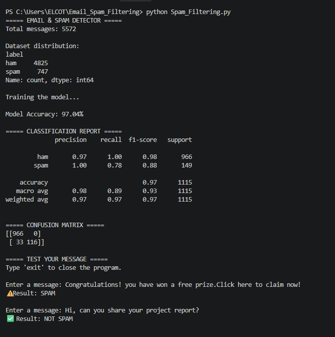

# 📧 Email & Spam Detection System

## 📌 Project Overview

Email & Spam Detection is a machine learning project that automatically
classifies messages as **Spam** or **Not Spam (Ham)**.

The system uses Natural Language Processing (NLP) and the Multinomial
Naive Bayes algorithm to identify unwanted messages.

## 🎯 Objectives

- Detect spam messages automatically
- Classify messages as Spam or Ham
- Apply NLP techniques to text data
- Train and evaluate a machine learning model
- Provide real-time message classification

## 🛠️ Technologies Used

- Python
- Pandas
- Scikit-learn
- TF-IDF Vectorization
- Multinomial Naive Bayes
- Natural Language Processing
- VS Code

## 📂 Project Structure

```text
Email_Spam_Filtering/
│
├── spam_detector.py
├── SMSSpamCollection
├── dataset.csv
├── requirements.txt
└── README.md
## 📈 Evaluation

The model was evaluated using an 80/20 train-test split.

### Performance

| Metric | Result |
|---|---:|
| Total Messages | 5,572 |
| Training Data | 80% |
| Testing Data | 20% |
| Model Accuracy | **97.04%** |

### Classification Report

| Class | Precision | Recall | F1-Score |
|---|---:|---:|---:|
| Ham | 0.97 | 1.00 | 0.98 |
| Spam | 1.00 | 0.78 | 0.88 |

### Confusion Matrix

```text
[[966   0]
 [ 33 116]]
 ## Project Results
 ###Spam Filtering Results
 
 ## 📚 Dataset Source

This project uses the **SMS Spam Collection** dataset provided by the UCI Machine Learning Repository.

- Dataset: SMS Spam Collection
- Source: UCI Machine Learning Repository
- Dataset Link: https://archive.ics.uci.edu/dataset/228/sms%2Bspam%2Bcollection
- License: CC BY 4.0

The dataset contains labeled messages classified as **ham (legitimate)** or **spam**.